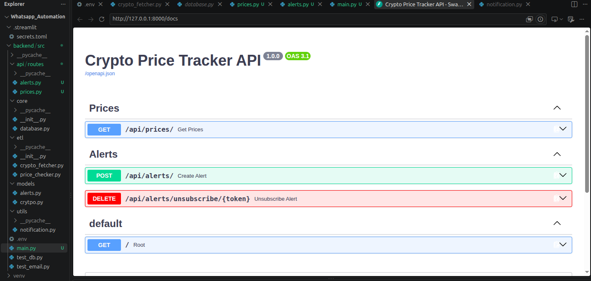

# Crypto Dashboard & Alert Engine

A backend-driven cryptocurrency monitoring system that tracks live market data, stores price history, evaluates user-defined threshold alerts, and sends notifications through WhatsApp or email.

This project is designed for tracking assets like BTC, ETH, and SOL and notifying the user when a specific price or percentage condition is met.


## Overview

The application combines three core ideas:

- Data collection through scheduled ETL jobs
- A lightweight database layer for storing prices and alerts
- A FastAPI backend that exposes price and alert routes to the frontend or external services

The system is built to support:

- market price tracking
- alert creation and management
- unsubscribe support through secure tokens
- WhatsApp and email notifications
- future frontend/dashboard integration

## Features

- Fetch crypto prices and save them to PostgreSQL
- Store the latest market data per symbol
- Create alerts for price thresholds and conditions
- Track active and inactive alerts
- Prevent repeated notifications with cooldown logic
- Expose API routes for prices and alerts via FastAPI
- Support notifications through WhatsApp and email

## Tech Stack

- Python 3.10+
- FastAPI
- SQLAlchemy
- PostgreSQL
- yfinance
- python-dotenv
- Twilio for WhatsApp
- Python email support via SMTP

## Project Structure

```text
Whatsapp_Automation/
├── app.py
├── README.md
├── image.png
├── whatsapp_script.py
├── PyWhatKit_DB.txt
├── venv/
├── backend/
│   └── src/
│       ├── api/
│       │   └── routes/
│       │       ├── alerts.py
│       │       └── prices.py
│       ├── core/
│       │   └── database.py
│       ├── etl/
│       │   ├── crypto_fetcher.py
│       │   └── price_checker.py
│       ├── models/
│       │   ├── alerts.py
│       │   └── crytpo.py
│       ├── utils/
│       │   └── notification.py
│       ├── main.py
│       ├── test_db.py
│       └── test_email.py
└── .gitignore
```

## Database Design

### crypto_prices

This table stores stored market snapshots for crypto symbols.

Columns include:

- id
- symbol
- price
- change_24h
- volume
- timestamp

### alerts

This table stores user alert conditions and status metadata.

Columns include:

- id
- symbol
- target_price
- condition
- contact
- notification_method
- unsubscribe_token
- is_active
- created_at
- deactivated_at
- last_notified_at
- triggered_count
- last_trigger_price

## Environment Configuration

Create a `.env` file in the backend source folder or the project root depending on your local setup.

Example:

```env
DB_USER=your_db_user
DB_PASSWORD=your_db_password
DB_HOST=localhost
DB_PORT=5432
DB_NAME=financial_db

TWILIO_ACCOUNT_SID=your_twilio_sid
TWILIO_AUTH_TOKEN=your_twilio_token
TWILIO_WHATSAPP_FROM=whatsapp:+14155238886

EMAIL_HOST=smtp.gmail.com
EMAIL_PORT=587
EMAIL_USER=your_email@example.com
EMAIL_PASSWORD=your_email_password
```

> Make sure your database is created before running the API or ETL scripts.

## Installation

Create and activate a virtual environment:

```bash
python3 -m venv venv
source venv/bin/activate
```

Install dependencies:

```bash
pip install -r requirements.txt
```

If there is no `requirements.txt`, install the packages manually:

```bash
pip install fastapi uvicorn sqlalchemy psycopg2-binary python-dotenv yfinance twilio
```

## Running the API

From the backend source folder:

```bash
cd backend/src
uvicorn main:app --reload
```

Then open:

- http://127.0.0.1:8000/docs
- http://127.0.0.1:8000/redoc



## API Routes

### Prices

- GET `/api/prices/`
- Accepts a `symbol` query parameter like:

```text
/api/prices/?symbol=BTC-USD,ETH-USD,SOL-USD
```

### Alerts

- POST `/api/alerts/`
- DELETE `/api/alerts/unsubscribe/{token}`

These routes let the application create new alert subscriptions and unsubscribe users through a secure token.

## ETL Jobs

### Fetch Prices

This job pulls current market information and stores it in the database.

```bash
cd backend/src
python etl/crypto_fetcher.py
```

### Evaluate Alerts

This job checks the latest values against active alerts and sends notifications when conditions match.

```bash
cd backend/src
python etl/price_checker.py
```

## Notification Flow

1. A user creates an alert via the API.
2. The alert is stored in PostgreSQL.
3. The fetcher stores the latest price data.
4. The checker evaluates active alerts.
5. If the condition is met, the app sends a WhatsApp or email notification.
6. The user can unsubscribe using the generated token.

## Notes

- This project is a backend-first system and is meant to power a dashboard or frontend later.
- The current app is designed to be easily expanded with more route endpoints, more alert conditions, and stronger user management.
- The image included above is the visual preview for the dashboard/alert concept.

## Future Improvements

- add a frontend dashboard
- add user authentication
- store alert history in a separate table
- support more crypto pairs and complex conditions
- add scheduler/cron automation for ETL jobs
- add unit tests for alert evaluation and API validation

## License

This project is for personal or educational use unless otherwise specified.

## Contact

If you want to extend this project, the most relevant files to review are:

- [backend/src/main.py](backend/src/main.py)
- [backend/src/api/routes/alerts.py](backend/src/api/routes/alerts.py)
- [backend/src/api/routes/prices.py](backend/src/api/routes/prices.py)
- [backend/src/core/database.py](backend/src/core/database.py)
- [backend/src/etl/price_checker.py](backend/src/etl/price_checker.py)
